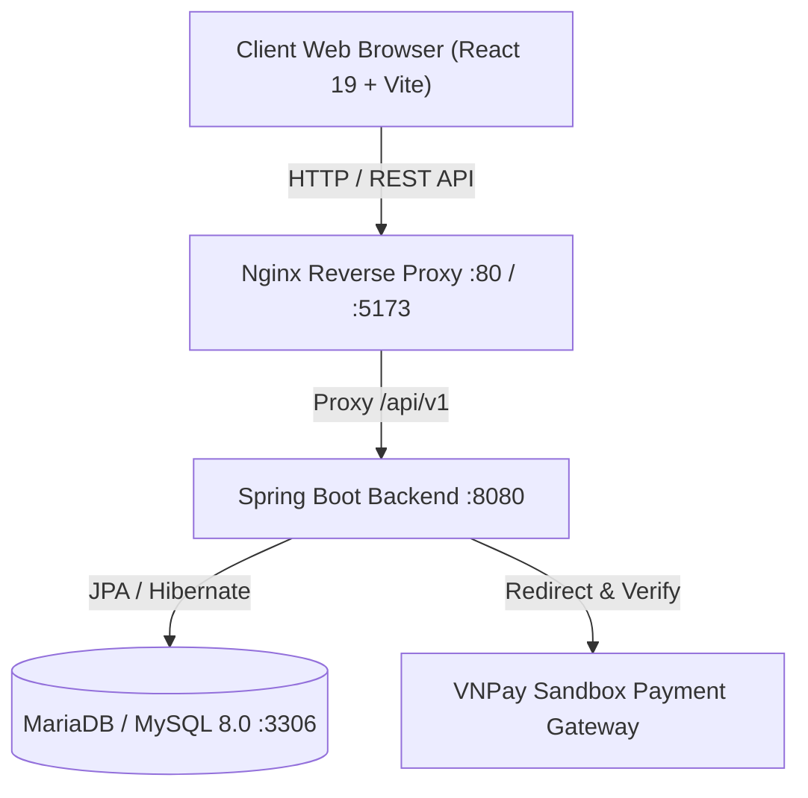

# TÀI LIỆU KỸ THUẬT VÀ HƯỚNG DẪN TRIỂN KHAI HỆ THỐNG
## ĐỀ TÀI: HỆ THỐNG QUẢN LÝ GIAO HÀNG (VIETTEL DELIVERY MANAGEMENT)

---

## 1. TỔNG QUAN DỰ ÁN & CÁC TÍNH NĂNG ĐÁP ỨNG

Hệ thống được xây dựng nhằm giải quyết bài toán giao nhận vận chuyển thông minh, tối ưu quy trình từ khi khách hàng tạo đơn, áp dụng khuyến mãi, điều phối phân công cho Shipper, cập nhật lộ trình đơn hàng theo thời gian thực đến thanh toán trực tuyến qua VNPay và phân tích số liệu trên Dashboard.

### Bảng đối chiếu 10 chức năng theo yêu cầu đề bài:
1. **Quản lý người dùng & Đăng nhập:** Hệ thống xác thực bằng JSON Web Token (JWT) Stateless, mã hóa mật khẩu BCrypt, phân quyền theo 3 vai trò chính: `ADMIN`, `SHIPPER`, `CUSTOMER`.
2. **Quản lý shipper:** Quản lý hồ sơ nhân viên giao hàng, số lượng đơn đang phụ trách, trạng thái sẵn sàng nhận đơn.
3. **Quản lý đơn hàng:** Khởi tạo đơn hàng, quản lý danh sách mặt hàng, tính toán khối lượng, cước phí và tiền thu hộ COD.
4. **Điều phối phân công vận chuyển:** Phân công đơn hàng mới cho nhân viên Shipper phù hợp, hỗ trợ ghi chú giao hàng.
5. **Thanh toán online:** Tích hợp cổng thanh toán trực tuyến VNPay Sandbox, tự động tạo URL thanh toán và xử lý IPN/Callback.
6. **Tracking theo dõi:** Tra cứu tiến trình đơn hàng công khai qua mã vận đơn (Tracking Number), hiển thị toàn bộ lịch sử trạng thái kèm bằng chứng giao nhận (Proof Image).
7. **Tính phí & Voucher:** Kiểm tra tính hợp lệ của mã giảm giá (thời hạn, giá trị đơn tối thiểu, số lượt dùng) và tự động khấu trừ cước phí giao hàng.
8. **Thông báo (Notification):** Tự động phát sinh thông báo khi đơn hàng được phân công hoặc thay đổi trạng thái, tích hợp chuông thông báo trên giao diện.
9. **Thanh toán (COD / Trực tuyến):** Hỗ trợ đa dạng phương thức thanh toán tiền mặt khi nhận hàng (COD) hoặc qua VNPay.
10. **Dashboard & Thống kê:** Báo cáo tổng quan số lượng đơn theo từng trạng thái, tổng doanh thu cước vận chuyển, biểu đồ phân tích trực quan.

---

## 2. KIẾN TRÚC HỆ THỐNG & CÔNG NGHỆ SỬ DỤNG



* **Backend:** Java 17+, Spring Boot 4.x, Spring Data JPA, Spring Security (JWT), Lombok, Hibernate Validator, Swagger / OpenAPI 3.
* **Frontend:** React 19, Vite, Tailwind CSS, Lucide React Icons, Axios Client.
* **Database:** MySQL 8.x / MariaDB 10.11.
* **DevOps / Triển khai:** Docker, Dockerfile đa tầng (Multi-stage build), Docker Compose.

---

## 3. THÔNG TIN DỮ LIỆU MẪU (AUTO-SEEDED DATA)

Hệ thống tích hợp sẵn `DataInitializer` tự động sinh dữ liệu khi khởi động lần đầu:

### 3.1. Danh sách tài khoản mẫu:
| Vai trò (Role) | Username | Password | Họ và tên | SĐT |
| :--- | :--- | :--- | :--- | :--- |
| **ADMIN** | `admin` | `admin123` | Quản Trị Viên Hệ Thống | 0988888888 |
| **SHIPPER** | `shipper1` | `shipper123` | Shipper Nguyễn Văn Giao | 0977777771 |
| **SHIPPER** | `shipper2` | `shipper123` | Shipper Trần Văn Nhanh | 0977777772 |
| **CUSTOMER** | `customer` | `customer123` | Khách Hàng Hoàng Anh | 0966666666 |

### 3.2. Danh sách Voucher mẫu:
* `VIETTEL50`: Giảm 50% phí vận chuyển (Tối đa 50.000 VNĐ cho đơn từ 100.000 VNĐ).
* `FREESHIP`: Giảm 100% phí vận chuyển (Tối đa 30.000 VNĐ cho đơn từ 50.000 VNĐ).
* `VIETTEL20`: Giảm 20% phí vận chuyển (Tối đa 20.000 VNĐ cho đơn từ 50.000 VNĐ).

---

## 4. HƯỚNG DẪN CÀI ĐẶT & TRIỂN KHAI

### Cách 1: Triển khai toàn bộ hệ thống bằng Docker Compose (Khuyên dùng)
Yêu cầu: Đã cài đặt Docker Desktop.

1. Mở terminal tại thư mục `delivery-management`:
   ```bash
   cd e:\JAVA_VIETTEL\delivery-management
   docker-compose up -d --build
   ```
2. Truy cập hệ thống:
   * **Giao diện Web Frontend:** `http://localhost:5173`
   * **Backend API Swagger:** `http://localhost:8080/api/v1/swagger-ui.html`
   * **Database:** `localhost:3306` (User: `delivery_user`, Pass: `hoang2005`, DB: `delivery_db`)

---

### Cách 2: Chạy trực tiếp trên môi trường Local

#### 1. Khởi động MySQL Database:
Tạo cơ sở dữ liệu `delivery_db` trong MySQL và cấu hình kết nối trong file `application.properties`.

#### 2. Khởi động Backend (Spring Boot):
```bash
cd e:\JAVA_VIETTEL\delivery-management
mvn clean spring-boot:run
```
*(Backend lắng nghe tại `http://localhost:8080/api/v1`)*.

#### 3. Khởi động Frontend (React Vite):
```bash
cd e:\JAVA_VIETTEL\delivery-frontend
npm install
npm run dev
```
*(Frontend lắng nghe tại `http://localhost:5173`)*.

---

## 5. KỊCH BẢN DEMO QUY TRÌNH HOÀN CHỈNH (STEP-BY-STEP DEMO)

### Bước 1: Khách hàng tạo đơn & Áp dụng Voucher
1. Truy cập `http://localhost:5173`, đăng nhập tài khoản Khách hàng (`customer` / `customer123`).
2. Vào tab **Tạo & Quản Lý Đơn**.
3. Điền thông tin người nhận, kiện hàng, nhập mã voucher `VIETTEL50` $\rightarrow$ Nhấn **"Xác Nhận Tạo Đơn"**.
4. Hệ thống sinh mã vận đơn (VD: `VT1234ABCD`) và hiển thị nút **"Thanh toán VNPay"** trực tuyến.

### Bước 2: Quản trị viên điều phối Shipper
1. Đăng xuất và đăng nhập tài khoản Quản trị (`admin` / `admin123`).
2. Vào tab **Điều Phối Shipper**, chọn ID đơn hàng vừa tạo, chọn **Shipper Nguyễn Văn Giao (ID: 2)** $\rightarrow$ Nhấn **"Xác Nhận Phân Công"**.
3. Hệ thống cập nhật trạng thái đơn sang `ASSIGNED` và gửi thông báo cho Shipper.

### Bước 3: Shipper nhận đơn & Giao hàng
1. Đăng nhập tài khoản Shipper (`shipper1` / `shipper123`).
2. Xem thông báo nhận đơn trên biểu tượng **Chuông Thông Báo**.
3. Tại tab **Điều Phối Shipper**, cập nhật trạng thái đơn sang `IN_TRANSIT` (Đang giao) rồi sang `DELIVERED` (Giao hàng thành công) kèm ảnh bằng chứng ký nhận.

### Bước 4: Khách hàng tra cứu lộ trình (Tracking)
1. Truy cập tab **Tra Cứu Đơn** (không cần đăng nhập).
2. Nhập mã vận đơn (VD: `VT1234ABCD`) $\rightarrow$ Xem toàn bộ timeline lộ trình từ lúc tạo đơn, phân công shipper đến lúc giao thành công.

### Bước 5: Xem báo cáo thống kê trên Dashboard
1. Đăng nhập tài khoản `admin`.
2. Vào tab **Dashboard** $\rightarrow$ Xem thống kê tổng số đơn hàng theo trạng thái, tổng doanh thu và biểu đồ trực quan.
