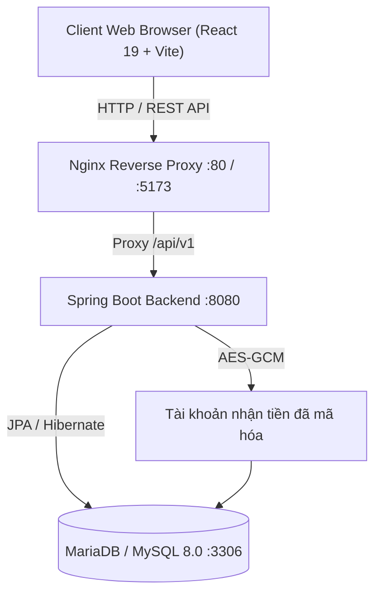

# TÀI LIỆU KỸ THUẬT VÀ HƯỚNG DẪN TRIỂN KHAI HỆ THỐNG
## ĐỀ TÀI: HỆ THỐNG QUẢN LÝ GIAO HÀNG (VIETTEL DELIVERY MANAGEMENT)

---

## 1. TỔNG QUAN DỰ ÁN & CÁC TÍNH NĂNG ĐÁP ỨNG

Hệ thống được xây dựng nhằm giải quyết bài toán giao nhận vận chuyển thông minh, tối ưu quy trình từ khi khách hàng tạo đơn, áp dụng khuyến mãi, điều phối phân công cho Shipper, cập nhật lộ trình đơn hàng theo thời gian thực, thanh toán COD và phân tích số liệu trên Dashboard.

### Bảng đối chiếu 10 chức năng theo yêu cầu đề bài:
1. **Quản lý người dùng & Đăng nhập:** Hệ thống xác thực bằng JSON Web Token (JWT) Stateless, mã hóa mật khẩu BCrypt, phân quyền theo 4 vai trò: `ADMIN`, `STAFF`, `SHIPPER`, `CUSTOMER`.
2. **Quản lý shipper:** Quản lý hồ sơ nhân viên giao hàng, số lượng đơn đang phụ trách, trạng thái sẵn sàng nhận đơn.
3. **Quản lý đơn hàng:** Khởi tạo đơn hàng, quản lý danh sách mặt hàng, tính toán khối lượng, cước phí và tiền thu hộ COD.
4. **Điều phối phân công vận chuyển:** Phân công đơn hàng mới cho nhân viên Shipper phù hợp, hỗ trợ ghi chú giao hàng.
5. **Thanh toán:** Đơn mới dùng COD. Luồng QR ngân hàng cũ đã được ngừng cho đơn mới; endpoint VNPay chỉ hoạt động khi được cấu hình riêng.
6. **Tracking theo dõi:** Tra cứu tiến trình công khai qua mã vận đơn với dữ liệu cá nhân/tài chính đã được ẩn; người dùng đã đăng nhập mới xem được chi tiết nghiệp vụ.
7. **Tính phí & Voucher:** Kiểm tra tính hợp lệ của mã giảm giá (thời hạn, giá trị đơn tối thiểu, số lượt dùng) và tự động khấu trừ cước phí giao hàng.
8. **Thông báo (Notification):** Tự động phát sinh thông báo khi đơn hàng được phân công hoặc thay đổi trạng thái, tích hợp chuông thông báo trên giao diện.
9. **Tài khoản nhận tiền:** Khách hàng có thể lưu tối đa 5 tài khoản để nhận hoàn tiền/đối soát COD. Số tài khoản được mã hóa AES-GCM, API chỉ trả về bốn số cuối; đây không phải liên kết Open Banking và không thu thập mật khẩu/OTP.
10. **Dashboard & Thống kê:** Báo cáo tổng quan số lượng đơn theo từng trạng thái, tổng doanh thu cước vận chuyển, biểu đồ phân tích trực quan.

---

## 2. KIẾN TRÚC HỆ THỐNG & CÔNG NGHỆ SỬ DỤNG



* **Backend:** Java 17+, Spring Boot 4.x, Spring Data JPA, Spring Security (JWT), Lombok, Hibernate Validator, Swagger / OpenAPI 3.
* **Frontend:** React 19, Vite, Tailwind CSS, Lucide React Icons, Axios Client.
* **Database:** MySQL 8.x / MariaDB 10.11.
* **DevOps / Triển khai:** Docker, Dockerfile đa tầng (Multi-stage build), Docker Compose.

---

## 3. KHỞI TẠO DỮ LIỆU

Flyway là nguồn duy nhất quản lý cấu trúc cơ sở dữ liệu. `DataInitializer` chỉ tạo dữ liệu tham chiếu/voucher khi cấu hình cho phép và không tự sửa schema lúc chạy.

### 3.1. Tài khoản quản trị ban đầu

Không có tài khoản hoặc mật khẩu mặc định. Khi triển khai lần đầu, đặt `BOOTSTRAP_ADMIN_ENABLED=true` và cung cấp mật khẩu mạnh qua biến môi trường. Sau khi tài khoản được tạo, đổi lại thành `false`. Khách hàng tự đăng ký; quản trị viên tạo tài khoản nhân viên và shipper theo quy trình của hệ thống.

### 3.2. Danh sách Voucher mẫu:
* `VIETTEL50`: Giảm 50% phí vận chuyển (Tối đa 50.000 VNĐ cho đơn từ 100.000 VNĐ).
* `FREESHIP`: Giảm 100% phí vận chuyển (Tối đa 30.000 VNĐ cho đơn từ 50.000 VNĐ).
* `VIETTEL20`: Giảm 20% phí vận chuyển (Tối đa 20.000 VNĐ cho đơn từ 50.000 VNĐ).

---

## 4. HƯỚNG DẪN CÀI ĐẶT & TRIỂN KHAI

### Cách 1: Triển khai toàn bộ hệ thống bằng Docker Compose (Khuyên dùng)
Yêu cầu: Đã cài đặt Docker Desktop.

1. Sao chép `.env.example` thành `.env`, thay toàn bộ mật khẩu mẫu, đặt `JWT_SECRET` ngẫu nhiên tối thiểu 32 ký tự và khai báo chính xác các origin frontend trong `CORS_ALLOWED_ORIGINS`.
2. Nếu bật mục **Tài khoản nhận tiền**, tạo một khóa AES 256-bit, Base64 hóa nó và đặt nguyên giá trị vào `BANK_ACCOUNT_ENCRYPTION_KEY`. Ví dụ trong PowerShell:
   ```powershell
   $bytes = New-Object byte[] 32
   $rng = [System.Security.Cryptography.RandomNumberGenerator]::Create()
   $rng.GetBytes($bytes)
   [Convert]::ToBase64String($bytes)
   ```
   Không đưa khóa này vào Git, log, ảnh chụp màn hình hoặc đổi/xóa khóa sau khi khách đã lưu tài khoản. Nếu chưa đặt khóa, backend vẫn khởi động nhưng từ chối lưu tài khoản nhận tiền mới.
3. Mở terminal tại thư mục `delivery-management`:
   ```bash
   cd e:\JAVA_VIETTEL\delivery-management
   docker-compose up -d --build
   ```
4. Truy cập hệ thống:
   * **Giao diện Web Frontend:** `http://localhost:5173`
   * **Backend API Swagger:** `http://localhost:8080/api/v1/swagger-ui.html`
   * **Database:** `localhost:3306` (thông tin đăng nhập lấy từ `.env`)

---

### Cách 2: Chạy trực tiếp trên môi trường Local

#### 1. Khởi động MySQL Database:
Tạo cơ sở dữ liệu `delivery_db` trong MySQL và cấu hình kết nối trong file `application.properties`.

#### 2. Khởi động Backend (Spring Boot):
```bash
cd e:\JAVA_VIETTEL\delivery-management
mvn clean spring-boot:run
```
*(Backend lắng nghe tại `http://localhost:8080/api/v1`)*.

#### 3. Khởi động Frontend (React Vite):
```bash
cd "e:\JAVA_VIETTEL\Delivery Management System UI_UX"
npm install
# Tạo .env.local với: VITE_API_BASE_URL=http://localhost:8080/api/v1
npm run dev
```
*(Frontend lắng nghe tại `http://localhost:8443`; nếu không đặt `.env.local`, UI sẽ dùng API Render mặc định.)*.

---

## 5. KỊCH BẢN DEMO QUY TRÌNH HOÀN CHỈNH (STEP-BY-STEP DEMO)

### Bước 1: Khách hàng tạo đơn & Áp dụng Voucher
1. Truy cập `http://localhost:8443`, đăng ký rồi đăng nhập bằng tài khoản khách hàng của bạn.
2. Vào tab **Tạo & Quản Lý Đơn**.
3. Điền thông tin người nhận, kiện hàng, nhập mã voucher `VIETTEL50` $\rightarrow$ Nhấn **"Xác Nhận Tạo Đơn"**.
4. Hệ thống sinh mã vận đơn (VD: `VT1234ABCD`) theo luồng thanh toán COD.

### Bước 1b: Khách hàng lưu tài khoản nhận tiền (tùy chọn)
1. Trong **Tài khoản của tôi** mở tab **Tài khoản nhận tiền**.
2. Nhập tên ngân hàng, tên chủ tài khoản và số tài khoản; tuyệt đối không nhập mật khẩu, OTP, mã PIN hoặc số thẻ.
3. Sau khi lưu, màn hình chỉ hiển thị `••••` và bốn số cuối. Có thể đặt mặc định hoặc xóa tài khoản.

### Bước 2: Quản trị viên điều phối Shipper
1. Đăng xuất và đăng nhập bằng tài khoản quản trị đã khởi tạo qua biến môi trường.
2. Vào tab **Điều Phối Shipper**, chọn đơn hàng vừa tạo và một shipper đang hoạt động $\rightarrow$ Nhấn **"Xác Nhận Phân Công"**.
3. Hệ thống cập nhật trạng thái đơn sang `ASSIGNED` và gửi thông báo cho Shipper.

### Bước 3: Shipper nhận đơn & Giao hàng
1. Đăng nhập bằng tài khoản shipper do quản trị viên tạo.
2. Xem thông báo nhận đơn trên biểu tượng **Chuông Thông Báo**.
3. Tại tab **Điều Phối Shipper**, cập nhật trạng thái đơn sang `IN_TRANSIT` (Đang giao) rồi sang `DELIVERED` (Giao hàng thành công) kèm ảnh bằng chứng ký nhận.

### Bước 4: Khách hàng tra cứu lộ trình (Tracking)
1. Truy cập tab **Tra Cứu Đơn** (không cần đăng nhập).
2. Nhập mã vận đơn (VD: `VT1234ABCD`) $\rightarrow$ Xem timeline trạng thái đã được lược bỏ dữ liệu riêng tư. Đăng nhập để xem thông tin nghiệp vụ chi tiết theo quyền.

### Bước 5: Xem báo cáo thống kê trên Dashboard
1. Đăng nhập bằng tài khoản quản trị.
2. Vào tab **Dashboard** $\rightarrow$ Xem thống kê tổng số đơn hàng theo trạng thái, tổng doanh thu và biểu đồ trực quan.
